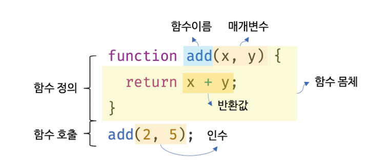
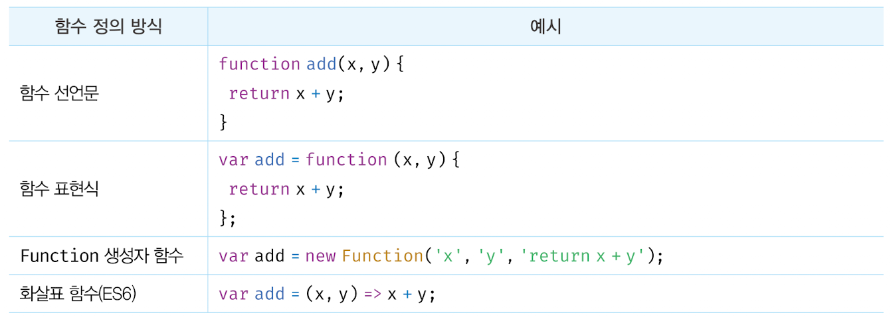

## 12.1 함수란?

> 함수는 일련의 과정을 문(statement)으로 구현하고 코드블록으로 감싸서 하나의 실행단위로 정의한것이다. 함수는 입력을 받아서 출력을 내보내며, 이때 함수 내부로 입력을 전달받는 변수를 **매개변수(parameter)**, 입력을 **인수(argument)**, 출력을 **반환값**이라고 한다.



```jsx
function add(x, y) {
  return x + y;
}

//함수 add에 인수 2, 5를 전달하면서 호출하면 반환값 7을 반환한다.
let result = add(2, 5);
console.log(result); // 7
```

<br>

## 12.2 함수를 사용하는 이유

- **코드의 재사용**: 동일한 작업을 반복적으로 수행한다면 `같은 코드를 중복`해서 여러번 작성하는 것이 아니라 미리 정의된 함수를 `재사용하는 것이 효율적`이다.
- **유지보수의 편의성**, **코드의 신뢰성**: 코드의 `중복을 억제`하고 실수를 줄여 코드의 신뢰성을 높인다.
- **코드의 가독성**: 함수 이름은 함수의 역할을 잘 설명하여 함수 내부 코드를 이해하지 않고도 함수의 역할을 파악할 수 있게 돕는다.
  <br>

## 12.3 함수 리터럴

> 자바스크립트의 함수는 **객체 타입**의 값이다. 함수는 **function 키워드**, **함수 이름,** **매개 변수 목록**, **함수 몸체**로 구성된다.

- **함수 이름**: 식별자 네이밍 규칙을 준수해야한다.
- **매개변수 목록**: 0개 이상의 매개변수를 소괄호로 감싸고 쉼표로 구분한다. 순서에 의미가 있다.
- **함수 몸체**: 함수가 호출되었을때 일괄적으로 실행될 문들을 하나의 실행 단위로 정의한 코드 블록이다.
  <br>

## 12.4 함수 정의

> 함수 정의란 함수를 호출하기 이전에 인수를 전달받을 **매개변수**와 **실행할 문**들, 그리고 **반환된 값**을 지정하는 것을 말한다.



### 12.4.1 함수 선언문

- **함수 선언문**은 `function` 키워드로 시작하고, `함수 이름`을 명시하여 함수를 정의하는 방식이다. 함수 선언문으로 정의된 함수는 자바스크립트 엔진에 의해 실행 컨텍스트가 생성되는 시점에 초기화되며, `호이스팅`된다. 이는 함수 선언문이 코드 어느 위치에 작성되었든지 상관없이 호출이 가능하다는 의미이다.
- 함수 선언문은 함수 이름을 생략할 수 없다.

### 12.4.2 함수 표현식

- **함수 표현식**은 `함수를 변수에 할당`하는 방식으로, 함수 이름을 `생략`할 수 있어 **익명 함수**를 정의할 수 있다. 함수 표현식은 코드의 실행 시점에서 평가되므로, 함수 정의 이후에만 호출할 수 있다.

### 12.4.3 함수 생성 시점과 함수 호이스팅

- `함수 선언문`으로 정의된 함수는 코드가 실행되기 전에 자바스크립트 엔진에 의해 메모리에 로드되어 사용할 수 있게 되며, 이를 호이스팅이라고 한다. 반면, `함수 표현식`은 변수에 할당되기 전에는 사용할 수 없다.
  - **❓호이스팅**: 자바스크립트 엔진이 함수와 변수의 선언을 스코프의 최상단으로 끌어올리는 동작
- 함수 호이스팅은 함수를 호출하기 전에 반드시 함수를 선언해야한다는 당연한 규칙을 무시하므로 JSON창시자 Douglas Crockford는 `함수 선언문 대신 함수 표현식을 사용할 것을 권장`한다.

### 12.4.4 Function 생성자 함수

- 자바스크립트의 **Function 생성자 함수**를 사용하여 동적으로 함수를 생성할 수 있다. 하지만, 이 방법은 자주 사용되지는 않는다.

### 12.4.5 화살표 함수

- 화살표 함수(arrow function)는 function 키워드를 사용하지 않고 화살표 `⇒` 를 사용해 간결하게 함수를 정의할 수 있는 문법이다.
- `익명함수`로 정의하며, 생성자 함수로 사용할 수 없다.
  <br>

## 12.5 함수 호출

> 함수는 함수를 가리키는 **식별자**와 **한쌍의 소괄호인 함수 호출 연산자**로 호출한다. 함수를 호출하면 현재의 실행 흐름을 중단하고 호출된 함수로 실행 흐름을 옮긴다.

### 12.5.1 매개변수와 인수

- 함수를 실행하기 위해 필요한값을 `함수 외부에서 내부로 전달`할 필요가 있는 경우, `매개변수(parameter)`를 통해 `인수(argument)`를 전달한다.
- 인수는 값으로 평가 될수 있는 표현식이어야하며, 개수와 타입에 제한이 없다.

```jsx
function add(x, y) {
  // 매개변수
  return x + y;
}

let result = add(1, 2); // 인수
```

### 12.5.2 인수 확인

- 자바스크립트 함수는 매개변수와 인수의 개수가 일치하는지 확인하지 않기때문에 함수를 정의할때 적절한 확인이 필요하다.
  - **타입 체크**: `if (typeof x !== ‘number’ || typeof y !== ‘number’){…}`
  - **TypeScript**
  - **기본값 할당**: `function add(a = 0, b = 0, c = 0){…}`

### 12.5.3 매개변수의 최대 개수

**⭐️ 이상적인 함수는 한가지 일만 해야 하며 가급적 작게 만들어야한다**

- 함수의 매개변수는 적을수록 좋으며, 이상적인 매개변수 개수는 0개이며, 최대 3개 이상을 넘지 않는것을 권장한다. 만약 3개 이상의 매개변수가 필요하다면 객체를 인수로 전달하는 것이 유리하다.
  - 이때 주의해야할 것은, 객체를 함수 내부에서 변경하면 외부 객체에도 영향을 미치는 부수 효과가 있을 수 있다는 것이다.

### 12.5.4 반환문

- 함수는 return 키워드와 표현식(반환값)으로 이뤄진 반환문을 사용해 실행 결과를 함수 외부로 반환(return)할 수 있다.
- 반환문은 함수의 실행을 중단하고 함수 몸체를 빠져나가며, 표현식을 평가해 반환한다.

```jsx
function add(x, y) {
  return x + y;
  console.log("이부분은 실행되지 않음");
}

let result = add(1, 2);
```

<br>

## 12.6 참조에 의한 전달과 외부 상태의 변경

> 자바스크립트에서는 객체 타입의 값을 함수에 전달할 때 **참조에 의한 전달**이 이루어진다. 이는 객체의 참조 값(메모리 주소)이 함수에 전달된다는 의미로, 함수 내부에서 객체를 수정하면 원래 객체도 영향을 받는다. 반면, 원시 값(숫자, 문자열 등)은 **값에 의한 전달**이 이루어져, 함수 내부에서 값을 변경하더라도 원래 값은 변하지 않는다.

<br>

## 12.7 다양한 함수의 형태

### 12.7.1 즉시 실행 함수

- 함수 정의와 동시에 즉시 호출되는 함수. 한번만 실행되며 다시 호출할 수 없다.

### 12.7.2 재귀 함수

- 함수내부에서 자기자신을 다시 호출하는 함수

### 12.7.3 중첩 함수

- 함수 내부에 정의된 함수. 자신이 속한 외부 함수의 변수에 접근할 수 있다.
- 주로 외부 함수를 돕는 helper function의 역할을 한다.

### 12.7.4 콜백 함수

- 다른 함수에 인수로 전달되어 실행되는 함수
- 비동기 작업이나 반복작업에서 주로 사용됨

### 12.7.5 순수 함수와 비순수 함수

- 순수 함수: 어떤 외부 상태에 의존하지도 않고 변경하지도 않는 함수
- 비순수 함수: 외부 상태에 의존하거나 외부 상태를 변경하는 함수

<br>

## 면접 질문

1. 자바스크립트에서 함수가 호이스팅되는 방식과 함수 선언문과 함수 표현식의 호이스팅 차이를 설명해주세요.
2. 자바스크립트에서 화살표 함수와 일반 함수의 차이점은 무엇인가요?
