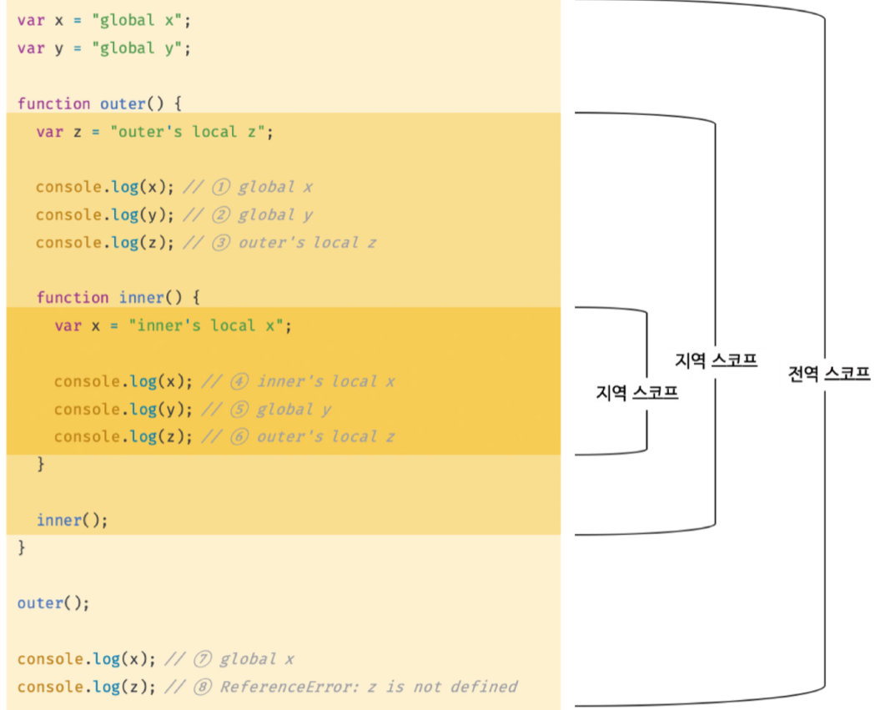

## 13장 스코프
### 13.1 스코프란?
> 모든 식별자(변수 이름, 함수 이름, 클래스 이름 등)는 자신이 선언된 위치에 의해 다른 코드가 식별자 자신을 참조할 수 있는 유효 범위가 결정된다.
> 식별자가 유효한 범위

```javascript
function add(x, y) {
  console.log(x, y);
  return x + y;
}

add(2, 5);

console.log(x, y);
```

x와 y는 함수 몸체 내부로만 참조할 수 있고, 외부에서는 참조할 수 없다.

```javascript
var x = 'global'; // 전역 스코프

function foo() {
  var x = 'local'; // foo 함수 스코프
  console.log(x); // 1
}

foo();

console.log(x); // 2
```

- 1, 2에서 x 변수는 어떤 변수를 참조할 것인지 정하는 것을 __식별자 결정__ 이라고 한다.
- 만약 스코프가 존재하지 않는다면, 변수는 충돌을 일으켜 프로그램 전체에서 변수 이름을 하나밖에 사용할 수 없다.

#### 식별자
> 어떤 값을 구별하여 식별해낼 수 있는 고유한 이름

- 식별자는 어떤 값을 구별할 수 있어야 하므로 __유일__ 해야 한다. 따라서 식별자인 변수 이름은 중복될 수 없다.
즉, 하나의 값은 유일한 식별자에 연결 (name binding) 되어야 한다.
- 프로그래밍 언어에서 스코프를 통해 식별자인 변수 이름의 충돌을 방지하여 같은 이름의 변수를 사용할 수 있게 해야 한다. 스코프 내에서 식별자는 유일해야 하지만 다른 스코프에는 같은 이름의 식별자를 사용할 수 있다. 즉, 스코프는 __네임스페이스__ 다.

### 13.2 스코프의 종류
> 코드는 전역과 지역으로 구분할 수 있다.

|구분|설명|스코프|변수|
|---|---|---|---|
|전역|코드의 가장 바깥 영역|전역 스코프|전역 변수|
|지역|함수 몸체 내부|지역 스코프|지역 변수|

#### 13.2.1 전역과 전역 스코프


> 전역: 코드의 가장 바깥 영역
> 전역 변수는 어디서든지 참조 가능

#### 13.2.2 지역과 지역 스코프
> 지역: 함수 몸체 내부
> 지역 변수: 지역에서 선언한 변수
> 지역 변수는 자신의 지역 스코프와 하위 지역 스코프에서 유효함

### 13.3 스코프 체인
> 스코프는 함수의 중첩에 의해 계층적 구조를 갖는다.

global
x: 'global x'
y: 'blobal y'
⬆️
outer
z: 'outer's local z'
⬆️
inner
x: 'inner's local x'

> __스코프 체인__: 스코프가 계층적으로 연결된 것

변수를 참조할 때 자바스크립트 엔진은 스코프 체인을 통해 변수를 참조하는 코드의 스코프에서 시작하여 상위 스코프 방향으로 이동하며 선언된 변수를 __검색__ (identifier resolution)

자바스크립트 엔진은 코드를 실행하기 위해 위와 비슷한 자료구조인 __렉시컬 환경__ 을 실제로 생성한다.

변수가 선언되면 변수 식별자가 렉시컬 환경에 키로 등록되고 변수 할당이 일어나면 식별자의 값을 변경한다.

#### 13.3.1 스코프 체인에 의한 변수 검색
> 상위 스코프에서 유효한 변수는 하위 스코프에서 자유롭게 참조할 수 있지만 하위 스코프에서 유효한 변수를 상위 스코프에서 참조할 수 없다는 것을 의미

#### 13.3.2 스코프 체인에 의한 함수 검색
```javascript
function foo() {
  console.log('global function foo');
}

function bar() {
  function foo() {
    console.log('local function foo');
  }

  foo();
}

foo();
```

### 13.4 함수 레벨 스코프
> 지역은 함수 몸체 내부를 말하고 지역 스코프를 만든다.
> 즉, 코드 블록이 아닌 함수에 의해서 __만__ 지역 스코프가 생성된다.

대부분의 프로그래밍 언어: 모든 코드 블록이 지역 스코프를 만듦 => 블록 레벨 스코프
var로 선언한 변수: __오직__ 함수의 코드 블록만을 지역 스코프로 인정 => 함수 레벨 스코프

### 13.5 렉시컬 스코프
```javascript
var x = 1;

function foo() {
  var x = 10;
  bar();
}

function bar() {
  console.log(x);
}

foo(); // 1
bar(); // 1
```

자바스크립트는 __렉시컬 스코프__ 를 사용하는 언어로 함수를 어디서 호출했지가 아닌 함수를 __어디서 정의했는지__ 에 따라 상위 스코프를 결정한다. 즉, 함수의 상위 스코프는 언제나 자신이 정의된 스코프다.

