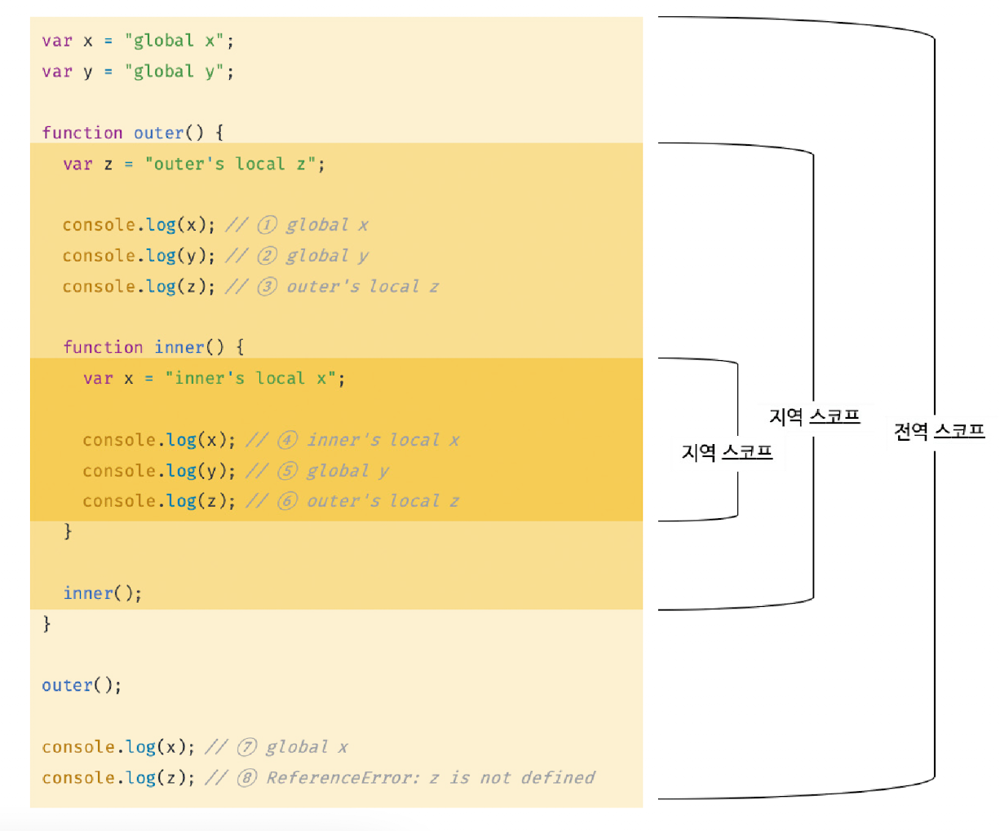

## 13.1 스코프란?

> 스코프(scope)는 모든 식별자(변수, 함수, 클래스 등)의 **유효한 범위**를 말한다. 모든 식별자는 자신이 선언된 위치에 의해 다른 코드가 식별자 자신을 참조할 수 있는 유효 범위가 결정된다.

- 식별자는 어떤 값을 구별 할 수 있어야 하므로 유일(unique)해야하기 때문에 스코프 내에서는 같은 이름의 변수를 사용할 수 없다.

<br>

## 13.2 스코프의 종류

> 코드는 전역(global)과 지역(local)로 구분할 수 있다.

- 변수는 자신이 선언된 위치(전역 또는 지역)에 의해 자신이 유효한 범위인 스코프가 결정된다.
  | 전역 | 코드의 가장 바깥 영역 | 전역(global) 스코프 | 전역 변수 |
  | ---- | --------------------- | ------------------- | --------- |
  | 지역 | 함수 몸체 내부 | 지역(local) 스코프 | 지역 변수 |



```jsx
var globalVar = "This is a global variable";

function exampleFunction() {
  var localVar = "This is a local variable";
  console.log(globalVar); // ⭕️
  console.log(localVar); // ⭕️
}

console.log(globalVar); // ⭕️
console.log(localVar); // ❌ ReferenceError: localVar is not defined (지역 변수 접근 불가)
```

<br>

## 13.3 스코프 체인

> **스코프 체인**은 스코프가 중첩된 계층적 구조를 말하며, 변수를 찾을때 상위 스코프로 이동하는 과정을 설명한다.

- 자바스크립트 엔진이 변수를 참조할 때 현재 스코프에서 찾지 못하면 상위 스코프로 이동하여 변수를 검색하는 과정이 스코프 체인을 통해 이루어진다.
- 이때, 상위 스코프에서 유효한 변수는 하위 스코프에서 자유롭게 참조할 수 있지만, 하위 스코프에서 유효한 변수를 상위 스코프에서 참조할 수 없다.


<br>

## 13.4 함수 레벨 스코프

> **함수 레벨 스코프**는 함수 내부에서만 생성되는 스코프를 의미하며, `var` 키워드로 선언된 변수가 이에 해당된다.

- 함수 레벨 스코프는 블록 레벨 스코프를 지원하지 않기 때문에 `if`나 `for` 문 같은 블록 내에서 선언된 `var` 변수는 블록 외부에서도 참조가 가능하다.
- ES6 이후 `let`과 `const` 키워드는 블록 레벨 스코프를 지원하여 이러한 문제를 해결한다.

```jsx
function exampleFunction() {
  var x = "This is a local variable";

  if (true) {
    var y = "This is also a local variable, but defined inside an if block";
    console.log(x); // ⭕️ (함수 내에서 선언된 변수에 접근 가능)
    console.log(y); // ⭕️ (블록 내에서 var로 선언된 변수에 접근 가능)
  }

  console.log(y); // ⭕️ (블록 외부에서도 var로 선언된 변수에 접근 가능)
}

exampleFunction();

console.log(x); // ❌ ReferenceError: x is not defined (함수 외부에서 지역 변수에 접근 불가)
console.log(y); // ❌ ReferenceError: y is not defined (함수 외부에서 지역 변수에 접근 불가)
```

<br>

## 13.5 렉시컬 스코프

> 렉시컬 스코프(Lexical Scope)는 함수가 호출된 위치가 아닌, **함수가 선언된 위치**에 따라 스코프가 결정되는 것을 의미한다.

- 자바스크립트는 렉시컬 스코프를 따르기 때문에, 함수가 어디서 호출되든지 간에 함수가 정의될 당시의 스코프를 기준으로 변수를 참조한다.

```jsx
var x = 10;

function outerFunction() {
  var x = 20;

  function innerFunction() {
    console.log(x); // ⭕️ 20 (렉시컬 스코프에 따라 외부 함수의 x를 참조)
  }

  innerFunction();
}

outerFunction();

console.log(x); // ⭕️ 10 (전역 변수 x를 참조)
```

<br>

## 면접 질문

1. 스코프 체인이란 무엇이며, 자바스크립트 엔진이 변수를 찾을 때 스코프 체인이 어떻게 작동하는지 설명해주세요.
2. 함수 레벨 스코프와 블록 레벨 스코프의 차이점을 설명하고, var와 let/const의 차이점에 대해 설명해주세요.
