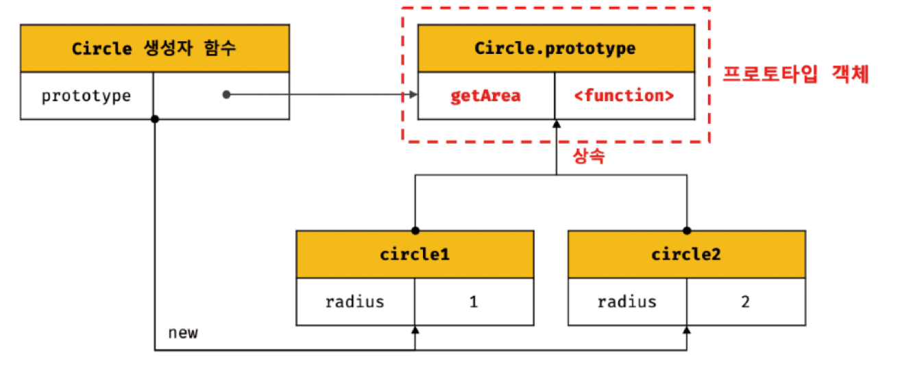
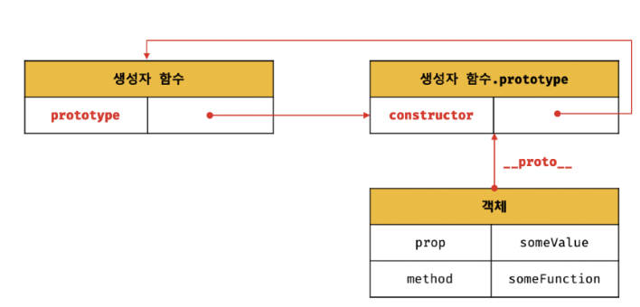
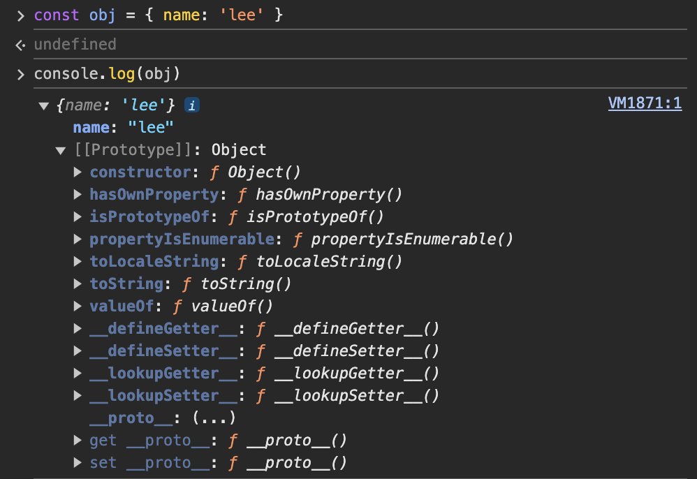
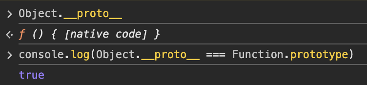
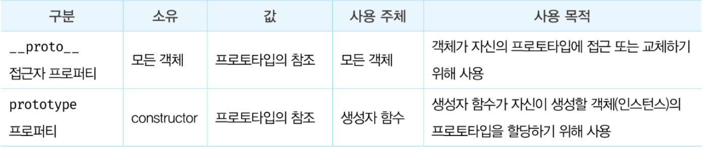

## 19장. 프로토타입
### 자바스크립트
> 명령어, 함수형, 프로토타입 기반 객체지향 프로그래밍을 지원하는 멀티 패러다임 프로그래밍 언어
>
> 객체 기반의 프로그래밍 언어이며 거의 "모든 것(원시 값 외)"이 객체다

### 19.1 객체지향 프로그래밍
절차지향적 관점에서 벗어나 여러 개의 독립적 단위인 객체의 집합으로 프로그램을 표현하려는 프로그래밍 패러다임

사람
- 이름
- 직업
- 나이
- 성별
- 체중
- 가족
- etc

Ex ) 영화관

```js
const person1 = {
  name: 'lee',
  age: 17,
  ticket: true
}
```

> 다양한 __속성__ 에서 필요한 속성만 간추려 표현한 것을 __추상화__

#### 객체
> 이처럼 속성을 통해 여러 개의 값을 하나의 단위로 구성한 복합적인 자료구조 

```js
const student = {
  age: 12,
  sayHello: () => { console.log('hello ~') }
}
```

age: 상태 => 프로퍼티
sayHello: 동작 => 메서드

### 19.2 상속과 프로토타입
#### 상속
어떤 객체의 프로퍼티 또는 메서드를 다른 객체가 상속받아 그대로 사용할 수 있는 것.

자바스크립트는 프로토타입을 기반으로 상속을 구현

```js
function Circle(radius) {
  this.radius: radius;
  this.getArea: function() {
    return Math.PI * this.radius ** 2;
  }
}

const circle1 = new Circle(1)
const circle2 = new Circle(2)

console.log(circle1.getArea())
console.log(circle2.getArea())
```

> 상속을 통해 재사용할 수 있음.


```js
function Circle(radius) {
  this.radius: radius;
}

Circle.prototype.getArea = function() {
  return Math.PI * this.radius ** 2;
}
  
const circle1 = new Circle(1)
const circle2 = new Circle(2)

console.log(circle1.getArea())
console.log(circle2.getArea())
```



### 19.3 프로토타입 객체
- 어떤 객체의 상위(부모) 객체의 역할을 하는 객체로서 다른 객체에 공유 프로퍼티를 제공
- 상속받은 하위(자식) 객체는 상위 객체의 프로퍼티를 자신의 프로퍼티처럼 자유롭게 사용 가능

- 모든 객체는 `[[Prototype]]` 이라는 내부 슬롯을 가짐
- 내부 슬롯의 값은 프로토타입의 참조
- 프로토타입은 객체 생성 방식에 의해 결정
즉, 객체가 생성될 때 객체 생성 방식에 따라 프로토타입 결정

- 모든 객체는 하나의 프로토타입을 갖으며, 모든 프로토타입은 생성자 함수와 연결되어 있다.



`[[Prototype]]` 내부에 직접 접근할 수 없고 접근자 프로퍼티를 이용하면 간접적으로 접근할 수 있다.

#### 19.3.1 `__proto__` 접근자 프로퍼티
모든 객체는 `__proto__` 접근자 프로퍼티를 통해 자신의 `[[Prototype]]` 내부 슬롯에 간접적으로 접근할 수 있다.



- `obj.__proto__` = Object.prototype

주의 ⚠️


#### `__proto__`는 접근자 프로퍼티다
__내부 슬롯__
ECMAScript 문서에서 자바스크립트 내부 동작의 설명을 위해 정의해 놓은 가상 메소드로 엔진에서 주로 사용

`[[...]]` 다음과 같이 사용

__접근자 프로퍼티__
`[[get]]`과 `[[set]]` 으로 구성된 프로퍼티

Object.prototype에 접근하기 위해 `__proto__`를 사용하면 내부 getter 함수 `[[get]]`이 호출되어 프로토타입에 접근할 수 있다. 그리고 새로운 프로토타입을 할당하면 `__proto__` 접근자 프로퍼티의 setter 함수 `[[set]]`이 호출된다.

```js
const obj = {}
const parent = { x: 1 }

obj.__proto__ // `[[get]]` 호출
obj.__proto__ = parent // `[[set]]` 호출
```

#### `__proto__` 접근자 프로퍼티는 상속을 통해 사용된다.
`__proto__` 접근자 프로퍼티는 객체가 직접 소유하는 것이 아닌 Object.prototype의 프로퍼티이다.

모든 객체는 Object.prototype을 상속받으며 `__proto__` (접근자 프로퍼티)를 사용하여 접근할 수 있다.

#### `__proto__` 접근자 프로퍼티를 통해 프로토타입에 접근하는 이유
```js
const parent = {};
const child = {};

child.__proto__ = parent;
parent.__proto__ = child; // X
```

- 프로토타입 체인은 단방향 링크드 리스트로 구현되야 한다.

#### `__proto__` 접근자 프로퍼티를 코드 내에서 직접  사용하는 것은 권장하지 않는다.
모든 객체가 `__proto__` 접근자 프로퍼티를 사용할 수 있는 것은 아니기 때문에 접근자 프로퍼티를 직접 사용하는 것은 권장하지 않는다.

프로토타입의 참조를 취득하고 싶은 경우, Object.getPrototypeOf 메서드를 사용하고, 교체하고 싶다면 Object.setPrototypeOf 메서드를 사용하는 것이 권장된다.

#### 19.3.2 함수 객체의 prototype 프로퍼티 & 19.3.3 프로토타입의 constructor 프로퍼티와 생성자 함수

함수 객체만이 소유하는 prototype 프로퍼티는 / 생성자 함수가 생성할 인스턴스의 프로토타입을 가리킨다.

```js
// 생성자 함수
function Person(name) {
  this.name = name
}

// Person은 함수이므로 prototype이라는 프로퍼티를 가짐
// 이 값은 생성자 함수가 생성할 인스턴스의 프로토타입을 가리킴
// Person
// {
// property: [[object prototype]]
// }

const me = new Person('lee') // 인스턴스 생성

console.log(Person.prototype === me.__proto__) // true
console.log(Person.prototype.constructor === Person)
console.log(me.__proto__.constructor === Person)
console.log(me.constructor === Person)

const you = new me.constructor('you')
```

즉, 생성자 함수의 prototype은 객체의 `__proto__` 접근자 프로퍼티와 같다.


```js
// arrow funciton
const Person = name => {
  this.name = name;
}

// 메서드 단축 표현
const obj = {
  foo() {}
}
```

다음과 같은 함수들은 constructor가 존재하지 않기 때문에 non-constructor 이므로 prototype 프로퍼티를 소유하지 않으며 프로토타입도 생성하지 않는다.

> 모든 객체가 가지고 있는(Object.prototype으로부터 상속받은) `__proto__` 접근자 프로퍼티와 함수 객체만이 가지고 있는 prototype 프로퍼티는 결국 동일한 프로토타입을 가리킨다.

하지만, 사용하는 주체가 다르다.


#### 19.4 리터럴 표기법에 의해 생성된 객체의 생성자 함수와 프로토타입
```js
const obj = new Object()
console.log(obj.constructor === Object)

const add = new Function('a', 'b', 'return a + b')
console.log(add.constructor === Function)

function Person(name) {
  this.name = name
}
const me = new Person('lee')
console.log(me.constructor === Person)
```

하지만, new 연산자 없이 리터럴을 통해 객체를 생성하는 방식도 존재한다.

```js
const obj = {
  name: 'lee',
  age: 12
}

const add = function (a, b) { return a + b }

const arr = [1, 2, 3]

const regexp = /is/ig

console.log(obj)
// Object
console.log(add)
// Function
console.log(arr)
// Array
console.log(regexp)
// RegExp
```

프로토타입과 생성자 함수는 단독으로 존재할 수 없고 언제나 쌍으로 존재한다.

즉, 리터럴 표기법에 의해 생성된 객체는 생성자 함수에 의해 생성된 객체는 아니지만, 생성자 함수로 생성된 것과 같은 결과를 낸다.

#### 19.5 프로토타입의 생성 시점
프로토타입은 __생성자 함수가 생성되는 시점__ 에 생성된다.

생성자 함수는 두 가지로 구분할 수 있다.
- 사용자 정의 생성자 함수
- 빌트인 생성자 함수

사용자 정의 생성자 함수
constructor는 함수 정의가 평가되어 함수 객체를 생성하는 시점에 프로토타입도 더불어 생성된다.

```js
console.log(Person.prototype)
// constructor, [[prototype]] -> 프로토타입도 객체이기 때문에 Object.prototype을 가지고 있음

function Person(name) {
  this.name = name
}
```

```js
console.log(Person.prototype) // error (호이스팅)

var Person = function(name) {
  this.name = name
}
```

빌트인 생성자 함수
전역 객체가 생성되는 시점에 생성된다.
즉, 객체가 생성되기 이전에 함수와 프로토타입은 이미 객체화되어 존재한다.

#### 19.6 객체 생성 방식과 프로토타입의 결정
객체 생성 방법
- 객체 리터럴
- Object 생성자 함수
- 생성자 함수
- Object.create 메서드
- 클래스

다양한 방식으로 생성된 모든 객체는 각 방식마다 세부적인 객체 생성 방식의 차이는 있으나 / 추상 연산 OrdinaryObjectCreate에 의해 생성된다는 공통점이 있다.

추상 연산 OrdinaryObjectCreate는 필수적으로 자신이 생성할 객체의 __프로토타입__ 을 인수로 받는다.

OrdinaryObjectCreate 함수 동작 과정
1. 빈 객체 생성
2. 프로퍼티 목록이 인수로 전달된 경우 프로퍼티를 객체에 추가 [optional]
3. 인수로 전달받은 프로토타입을 `[[Prototype]]` 내부 슬롯에 할당
4. 객체 반환

객체 리터럴
Object.prototype 인자에 전달
`[[Prototype]]`에 Object.prototype을 채움

Object 생성자 함수에 의해 생성된 객체의 프로토타입
빈 객체가 생성된다.
Object.prototype이 인자로 전달된다.
객체 리터럴과 차이점은 프로퍼티를 초기에 할당하느냐 혹은 추가하느냐이다.

생성자 함수에 의해 생성된 객체의 프로토타입
```js
function Person(name) {
  this.name = name
}

const me = new Person('lee')
```
프로토타입에 생성자 함수 Person이 바인딩되어 있는 객체가 생성된다.

#### 19.7 프로토타입 체인
자바스크립트는 객체의 프로퍼티에 접근하려고 할 때 해당 객체에 접근하려는 프로퍼티가 없다면 `[[Prototype]]` 내부 슬롯의 참조를 따라 자신의 부모 역할을 하는 프로토타입의 프로퍼티를 순차적으로 검색한다.

프로토타입 체인은 상속과 프로퍼티 검색을 위한 메커니즘

#### 19.8 오버라이딩과 프로퍼티 섀도잉
```js
const Person = (function () {
  function Person(name) {
    this.name = name
  }

  Person.prototype.sayHello = function () {
    console.log(`hi, my name is ${this.name}`) // sayHello shadowing
  }

  return Person
}())

const me = new Person('lee')

me.sayHello = function () {
  console.log('override') // sayHello override
}

me.sayHello() // override
```

```js
me.sayHello = function () {
  console.log('override') // sayHello override
}
```

me 객체 프로퍼티에 추가한거지 프로토타입 메소드를 변경한 것은 아님
-> 하위 객체 (자식 객체) 로 프로포타입을 변경 또는 삭제할 수 없음

```js
delete me.sayHello
delete me.sayHello

me.sayHello() // 프로토타입 메소드 실행
```

따라서 변경하기 위해서는 프로토타입 체인이 아닌 직접 프로토타입에 접근해야 한다.

#### 19.9 프로토타입의 교체
프로토타입은 임의의 다른 객체로 변경할 수 있다. 즉, 부모 객체인 프로토타입을 동적으로 변경할 수 있다.

이는 객체 간의 상속 관계를 동적으로 변경할 수 있으며, 프로토타입은 생성자 함수 또는 인스턴스에 의해 교체될 수 있다.

#### 19.10 instanceof 연산자
```js
객체 instanceof 생성자 함수
```

```js
const me = new Person('Lee')

console.log(me instanceof Person) // true
console.log(me instanceof Object) // true
```

좌변의 객체의 프로토타입 체인 상에 존재하면 true 아니면 false

#### 19.11 직접 상속
Object.create 메서드는 명시적으로 프로토타입을 지정하여 새로운 객체를 생성한다.

#### 19.12 정적 프로퍼티/메서드
정적 프로퍼티/메서드는 생성자 함수로 인스턴스를 생성하지 않아도 참조/호출할 수 있는 프로퍼티/메서드를 말한다.

```js
function Person(name) {
  this.name = name
}

Person.prototype.sayHello = function () {
  console.log(`hi, my name is ${this.name}`)
}

// 정적 프로퍼티
Person.staticProp = 'static prop'

// 정적 메서드
Person.staticMethod = function () {
  console.log('staticMethod')
}

const me = new Person('Lee')

Person.staticMethod() // staticMethod
me.staticMethod() // Error
```

Person 생성자 함수는 "객체"이므로 프로퍼티/메서드를 소유할 수 있다.
이를 정적 프로퍼티/메서드 라고 한다.

#### 19.13 프로퍼티 존재 확인
```js
key in object
```

```js
const person = {
  name: 'lee',
  address: 'Seoul'
}

console.log('name' in person) // true
console.log('age' in person) // false
console.log('toString' in person) // true
```

#### console.log('toString' in person) 왜 true ?
Object.prototype의 메서드에 있기 때문에

때문에 in 대신, Reflect.has 메서드를 사용할 수 있음 (ES6)

Object.prototype.hasOwnProperty 메서드도 가능함

#### 19.14 프로퍼티 열거
```js
for (변수선언문 in 객체) { ... }
```

```js
const person = {
  name: 'lee',
  address: 'Seoul'
}

for (const key in person) {
  console.log(key + person[key])
}
```

'toString' in person은 true이지만, `[[Enumerable]]`의 값이 false이기 때문에 toString은 출력되지 않는다.

for ... in 문은 객체의 프로포타입 체인 상에 존재하는 모든 프로토타입의 프로퍼티 중에서 프로퍼티 어트리뷰트 `[[Enumerable]]` 의 값이 true인 프로퍼티를 순회하며 열거한다.

```js
const person = {
  name: 'lee',
  address: 'Seoul'
  __proto__: {age: 20}
}
```

=> age는 출력됨

Symbol은 열거하지 않음

상속받은 프로퍼티는 제외하고 자신의 프로퍼티만 열거하고 싶다면 hasOwnProperty를 통해 검사하면 됨.

배열에는 for ... in 문보다는 for 문 혹은 for ... of 문 또는 Array.prototype.forEach 메서드를 사용하는 것을 권장.

객체 자신의 고유 프로퍼티만 열거할 때 메서드를 통해 검사하는 방법만 있는 것은 아니다.
Object.keys/values/entries 메서드를 사용하는 것이 더 좋다.

