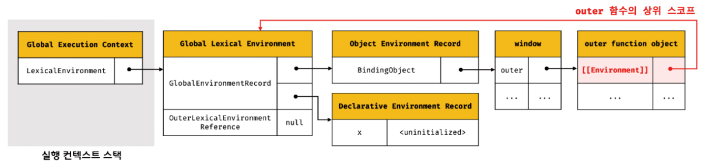

# 24장 클로저

---

### 클로저

> 함수와 그 함수가 선언된 렉시컬 환경과의 조합
> 

```jsx
const x = 1;

function outerFunc() {
    const x = 10;

		// outerFunc 스코프 내에 있기 때문에
		// outerFunc 내의 변수 x에 접근할 수 있음
    function innerFunc() {
        console.log(x);
    }

    innerFunc();
}

outerFunc();
```

### 24.1 렉시컬 스코프

> 자바스크립트 엔진은 함수를 어디서 호출했는지가 아니라 / 함수를 어디에 정의했는지에 따라 상위 스코프를 결정한다.
> 

```jsx
const x = 1;

function foo() {
	const x = 10;
	bar();
}

function bar() {
	console.log(x);
}

foo();
bar();
```

`foo()`

- x = 10
- bar 호출

`bar()`

- x 출력

⇒ foo 함수에서 정의된 `x = 10`을 출력하는 것이 아닌 함수가 정의된 위치가 전역 스코프이므로 `x = 1`을 출력함.

간단하게 정리

> 상위 스코프에 대한 참조는 / 함수 정의가 평가되는 시점에 / 함수가 정의된 환경에 의해 결정됨
> 

### 24.2 함수 객체의 내부 슬롯 [[Environment]]

렉시컬 스코프가 가능하기 위해서는 자신이 정의된 환경, 즉 상위 스코프를 기억해야 한다. 이를 위해 함수는 자신의 내부 슬롯 `[[Environment]]` 에 상위 스코프의 참조를 저장한다.

```jsx
const x = 1;

function foo() {
	const x = 10;
	bar();
}

function bar() {
	console.log(x);
}

foo();
bar();
```


1. 함수 실행 컨텍스트 생성
2. 함수 렉시컬 환경 생성
    1. 함수 환경 레코드 생성
    2. this 바인딩
    3. 외부 렉시컬 환경에 대한 참조 결정

### 24.3 클로저와 렉시컬 환경

```jsx
const x = 1

function outer() {
	const x = 10
	const inner = function() { console.log(x) }
	return inner
}

const innerFunc = outer()
innerFunc()
```

innerFunc는 outer 함수를 실행하여 `function() { console.log(x) }` 라는 함수를 할당받게 된다.

outer 함수가 종료되며, 생명 주기 (Life Cycle)이 마감되고, `x = 10` 변수 또한 생명 주기를 마감한다.

하지만, innerFunc는 10을 출력한다.

즉, console.log(x) 의 x는 outer 함수의 변수 x임을 알 수 있다.

⇒ 클로저

**클로저**

- 외부 함수보다 중첩 함수가 더 오래 유지되는 경우 중첩 함수는 이미 생명 주기가 종료한 외부 함수의 변수를 참조할 수 있다. 이러한 중첩 함수를 클로저라고 부른다.

**MDN의 클로저 정의**

- 클로저는 함수와 그 함수가 선언된 렉시컬 환경과의 조합

즉, 내부 함수는 외부 함수 (상위 스코프)를 기억하고 있기 때문에 상위 스코프의 생명주기가 끝나더라도 외부 함수의 변수에 접근할 수 있었던 것이다.

```jsx
function outer() {
	const x = 10
	const inner = function() { console.log(x) }
	return inner
}
```



- outer가 실행됨

```jsx
const inner = function() { console.log(x) }
```


- inner가 평가되어 outer를 가리키게 됨

```jsx
const innerFunc = outer()
```


- outer 함수가 종료되고, inner 함수를 반환하며 outer 함수의 실행 컨텍스트가 실행 컨텍스트 스택에서 제거됨
- 위처럼 컨택스트는 제거됐지만, 렉시컬 환경은 살아있음
- inner가 outer 렉시컬 환경을 참조하고 있으므로 가비지 컬렉터는 메모리 공간을 해제하지 않음

```jsx
innerFunc()
```


- 함수를 호출하며 inner 함수 실행 컨텍스트가 푸시됨

의미적으로는 모든 함수는 **클로저** 이지만, 최적화를 위해 중첩 함수가 상위 스코프보다 **오래** 살아있는 함수만 클로저라고 부른다.

```jsx
function foo() { // 상위 함수
	const x = 1
	const y = 2
	
	function bar() { // 중첩 함수
		console.log(x)
	}
}

const bar = foo()
bar()
```

bar는 x만 사용한다. 즉, y는 메모리 낭비

⇒ 브라우저는 알아서 y에 관한 메모리는 삭제

⇒ x는 자유 변수라고 부름

### 24.4 클로저의 활용

> 상태를 안전하게 **은닉** 하고 특정 함수에게만 상태 변경을 허용하는 데 사용할 수 있음
> 

```jsx
let num = 0

const increase = function() {
	return ++num
}

console.log(increase()) // 1
console.log(increase()) // 2
console.log(increase()) // 3
```

- num 변수가 공개되어 있음. increase만 변경하게 하고 싶음
- state를 유지하고 싶음

```jsx
const increase = (function() {
    let num = 0

    return function() {
        return ++num
    }
}())

console.log(increase()) // 1
console.log(increase()) // 2
console.log(increase()) // 3
```

- 정보를 은닉할 수 있음

```jsx
function makeCounter(aux) {
    let counter = 0

    return function() {
        counter = aux(counter)
        return counter
    }
}

function increase(n) {
    return ++n
}

function decrease(n) {
    return --n
}

const increaser = makeCounter(increase)
console.log(increaser()) // 1
console.log(increaser()) // 2

const decreaser = makeCounter(decrease)
console.log(decreaser()) // -1
console.log(decreaser()) // -2
```

- makeCounter 함수를 호출해 함수를 반환할 때마다 독립된 자신만의 렉시컬 환경을 갖게 됨

### 24.5 캡슐화와 정보 은닉

**캡슐화**

> 객체의 상태를 나타내는 프로퍼티와 동작인 메서드를 하나로 묶은 것
> 

`#정보은닉` `#결합도 낮춤`

자바스크립트는 `public` `private` `protected` 같은 접근 제한자를 제공하지 않기 때문에 모든 객체의 프로퍼티와 메서드는 `public`이다.

```jsx
function Person(_name, _age) {
	this.name = _name
	let age = _age
	
	this.sayHi = function() {
		console.log(`Hi, my name is ${this.name}. I am ${age}`)
	}
}

const me = new Person('lee', 24)
me.sayHi() // Hi, my name is lee. I am 24
console.log(me.name) // lee
console.log(me.age) // undefined
```

sayHi

- public
- 모든 프로퍼티 (name, age) 접근 가능

name

- public

age

- private

함수 내부에 변수를 선언했기 때문에 접근할 수 없다.

sayHi는 인스턴스 메서드이므로 prototype으로 변경할 수 있다.

하지만, prototype으로 하면 Person의 age는 지역 변수이므로 접근할 수 없다.

```jsx
const Person = (function() {
	let age = 0
	
	function Person(_name, _age) {
		this.name = name;
		age = _age
	}
	
	Person.prototype.sayHi = function() {
		console.log(`Hi, my name is ${this.name}. I am ${age}`)
	}
	
	return Person
}())
```

만약 다음과 같이 생성자 함수를 내부에서 만들어서 return 해주는 패턴으로 한다면

```jsx
const me = new Person('lee', 20)
const u = new Person('kim', 30)
me.sayHi() // Hi, my name is lee. I am 30
```

prototype.sayHi는 Person 생성자 함수가 호출될 때 생성되므로

new Person(’kim’, 30) 다음과 같은 코드를 실행하면 age: 30을 그리고 sayHi 프로토타입은 이 값을 참조하여 30을 출력하는 것

즉, 자바스크립트는 정보 은닉을 완전하게 지원하지 않는다.

### 24.6 자주 발생하는 실수

```jsx
var funcs = []

for (var i = 0; i < 3; i++) {
    funcs[i] = function () {return i}
}

for (var j = 0; j < funcs.length; j++) {
    console.log(funcs[j]())
}
```

결과

```jsx
3
3
3
```

var은 함수 레벨 스코프이므로 i를 return 하는 함수는 3을 return하게 됨

해결법

1. 즉시 실행 함수를 사용한다
2. let 키워드를 사용한다


for문이 실행되며 LOOP Lexical 환경이 생김

반복이 실행되며 새로운 렉시컬 환경 PRE-INTERATION Lexical Environment를 생성하고, for 문 코드 블록 내 식별자 값을 등록한다