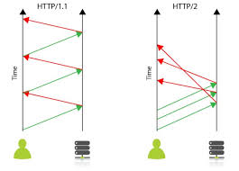
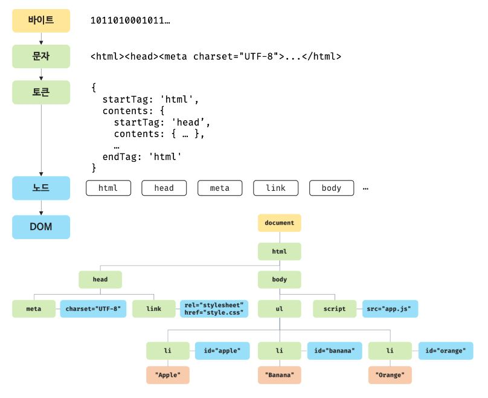
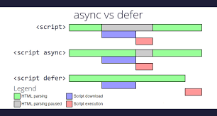

# 38. 브라우저의 렌더링 과정
### 자바스크립트

<aside>
💡

구글의 V8 자바스크립트 엔진으로 빌드된 자바스크립트 런타임 환경인 Node.js의 등장으로 자바스크립트는 웹 브라우저를 벗어나 서버 사이드 애플리케이션 개발에서도 사용할수 있는 범용 개발 언어가 되었다.

</aside>

### 브라우저의 렌더링

1. 주소창에 `https://example.com`와 같은 URL을 입력
2. DNS를 통해 IP 주소로 변환하고, IP 주소로 서버에게 요청을 전송
3. 루트 요청이기 때문에 암묵적으로 index.html을 응답함 (일반적, 꼭 그렇진 않음)
    - `https://example.com/data.json` ⇒ data.json 파일을 줄 것을 요청
    - 기본적으로 `https://example.com/index.html`을 요청
4. CSS, 자바스크립트, 이미지, 폰트 파일 등 렌더링에 필요한 `리소스를 요청`하고 `서버로부터 응답`받음
5. HTML과 CSS를 파싱하여 `DOM`과 `CSSOM`을 생성하고, 이를 결합하여 `렌더 트리`를 생성
6. 자바스크립트를 파싱하여 `AST`를 생성하고, 바이트코드로 변환하여 실행
7. `DOM API`를 통해 DOM 혹은 CSSOM을 변경했을 경우 렌더 트리에 반영
8. 렌더 트리를 기반으로 HTML 요소의 `레이아웃`을 계산하고 브라우저에 HTML 요소를 `페인팅`

### 38.1 요청과 응답

> 브라우저의 핵심 기능은 필요한 리소스를 서버에 요청하고 서버로부터 응답받아 브라우저에 시각적으로 렌더링하는 것
> 

> 렌더링 엔진은 HTML을 파싱하는 도중 외부 리소스를 로드하는 태그를 만나면 HTML 파싱을 중지하고 해당 리소스 파일을 서버로 요청한다 (38.8에서 자세히)
> 

### 38.2 HTTP 1.1과 HTTP 2.0

### HTTP ?

> HyperText Transfer Protocol
웹에서 브라우저와 서버가 통신하기 위한 프로토콜 (규약)
> 

### HTTP 1.1

> 기본적으로 커넥션 당 하나의 요청과 응답만 처리하기 때문에 여러 개의 요청을 한 번에 접송할 수도 없고 응답받을 수도 없다.

⇒ 동시 전송이 불가능한 구조이기 때문에 리소스의 개수에 비례하여 응답 시간도 증가하는 단점이 존재한다.
> 

### HTTP 2.0

> TCP 기반 프로토콜로 커넥션당 여러 개의 요청과 응답을 보내고 받을 수 있다.

https://tecoble.techcourse.co.kr/post/2021-09-20-http2/
> 

- NGINX에서는 다음과 같이 HTTP2를 사용할 수 있다.

```jsx
server {
    # ssl설정을 해주고, http2를 적어주면 쉽게 설정할 수 있다.
    listen 443 ssl http2;

    ssl_certificate ssl/certificate.pem;
    ssl_certificate_key ssl/key.pem;

    root /var/www/html;

    # index.html에 요청이 왔을 때, style.css, main.js, image.jpg 파일도 함께 서버 푸시된다.
    location = /index.html {
        http2_push /style.css;
        http2_push /main.js;
        http2_push /image.jpg;
    }
}
```



### + HTTP 3.0

> QUIC(UDP 기반) 프로토콜로 설계되었다.
Zero RTT(Round Trip Time), 패킷 손실에 대한 빠른 대응, 사용자 IP가 바뀌어도 연결이 유지된다는 장점이 존재한다.
https://namu.wiki/w/HTTP/3
> 

### 38.3 HTML 파싱과 DOM 생성

> 순수한 텍스트인 HTML 문서를 브라우저에 시각적으로 픽셀로 렌더링 하기 위해서 HTML 문서를 브라우저가 이해할 수 있는 자료구조(객체)로 변환하여 메모리에 저장해야 한다.
> 

> 응답받은 HTML 문서를 파싱하여 브라우저가 이해할 수 있는 자료구조인 DOM을 생성
> 



> 브라우저는 서버가 응답한 HTML 2진수 바이트 데이터를 문자열로 변환시킨다.
문자열로 변환된 HTML 문서를 읽어 코드의 최소 단위인 ‘토큰’들로 분해한다.
각 토큰들을 객체로 변환하여 Node를 생성한다.
모든 노드들을 ‘트리 자료구조’로 구성한다.
⇒ DOM
> 

즉, DOM은 HTML 문서를 파싱한 결과물이다.

### 38.4 CSS 파싱과 CSSOM 생성

> DOM을 생성해 나가다가 CSS를 로드하는 link 태그나 style 태그를 만나면 DOM 생성을 일시 중단한다.
CSS 파일을 서버에 요청하여 로드한 CSS 파일이나 style 태그 내의 CSS를
바이트 → 문자 → 토큰 → 노드 → CSSOM 변환 과정을 통해 CSSOM을 생성한다.
CSS 파싱이 완료되면 HTML 파싱이 중단된 지점부터 다시 HTML을 파싱하여 DOM 생성을 재개한다.
> 

> CSSOM은 CSS의 상속을 반영하여 생성된다.
> 

### 38.5 렌더 트리 생성

> DOM과 CSSOM은 렌더링을 위해 렌더 트리로 결합된다.
> 

> 렌더링을 위한 자료 구조이다. 따라서 브라우저에 렌더링이 필요없는 노드들은 포함되지 않는다.
> 

> 렌더 트리는 HTML 요소의 레이아웃을 계산하는 데 사용되며 브라우저 화면에 픽셀을 렌더링하는 페인팅 처리에 입력된다.
> 

<aside>
💡

레이아웃 계산과 페인팅을 다시 실행하는 리렌더링은 비용이 많이 드는 (성능에 영향을 주는) 작업이기 때문에 가급적으로 리렌더링이 빈번하게 발생하지 않도록 해야 한다.

</aside>

### 38.6 자바스크립트 파싱과 실행

> DOM을 조작하는 프로그래밍 인터페이스 DOM API를 제공한다.
자바스크립트 코드에서 DOM API를 사용하면 DOM을 동적으로 조작할 수 있다.
> 

> CSS 파싱과 마찬가지로 렌더링 엔진은 HTML을 한 줄 씩 순차적으로 파싱하며 DOM을 생성하다가 자바스크립트 파일을 로드하는 script 태그 혹은 자바스크립트 코드를 콘텐츠로 담은 script 태그를 만나면 DOM 생성을 일시 중단한다.
> 

> 브라우저는 자바스크립트 코드를 파싱하기 위해 자바스크립트 엔진에 제어권을 넘긴다.
자바스크립트 파싱과 실행이 종료되면 렌더링 엔진으로 다시 제어권을 넘겨 HTML 파싱이 중단된 시점부터 다시 HTML 파싱을 시작하여 DOM 생성을 재개한다.
> 

> 자바스크립트 파싱과 실행은 브라우저 렌더링 엔진이 아닌 자바스크립트 엔진이 처리한다.
자바스크립트 코드를 파싱하여 CPU가 이해할 수 있는 저수준 언어로 변환하고 실행한다.
> 

1. 토그나이징
    - 문법적 의미를 갖는 코드의 최소 단위인 토큰들로 분해한다.
2. 파싱
    - AST (Abstract Syntax Tree, 추상적 구문 트리)를 생성한다.
    - 인터프리터, 컴파일러뿐만 아니라 TypeScript, Babel, Prettier와 같은 트렌스파일러를 구현할 수도 있다.
3. 바이트코드 생성과 실행
    - 인터프리터가 실행할 수 있는 중간 코드 바이트코드로 변환되고 인터프리터에 의해 실행한다

### 38.7 리플로우와 리페인트

> DOM API가 사용되면 DOM과 CSSOM이 변경된다.
변경된 DOM과 CSSOM은 다시 렌더 트리로 결합되고 변경된 렌더 트리를 기반으로 레이아웃(리플로우)과 페인트 과정(리페인팅)을 고쳐 브라우저의 화면을 다시 렌더링한다.
> 

### 38.8 자바스크립트 파싱에 의한 HTML 파싱 중단

```jsx
<!DOCTYPE html>
<html>
	<head>
		<link rel='stylesheet' href='style.css'>
		<script src='app.js'></script>
	</head>
</html>
```

⇒ HTML을 파싱하고 실행하며 HTML 파싱이 블록킹된다.

⇒ 따라서, script 태그의 위치가 중요한데, body 요소의 가장 아래에 자바스크립트를 위치하는 것이 좋은 아이디어이다.

### 38.9 script 태그의 async / defer 어트리뷰트

> DOM 생성이 중단되는 문제를 근본적으로 해결하기 위해 HTML5부터 script 태그에 async defer 어트리뷰트가 추가된다.
> 

```jsx
<script async src="extern.js"></script>
<script defer src="extern.js"></script>
```

- HTML 파싱과 외부 자바스크립트 파일의 로드가 비동기적으로 동시에 진행된다.



### async 어트리뷰트

> HTML 파싱과 외부 자바스크립트 파일의 로드가 비동기적으로 동시에 진행된다.
> 

### defer 어트리뷰트

> 자바스크립트의 파싱과 실행은 HTML 파싱이 완료된 직후, 즉 DOM 생성이 완료된 직후에 진행된다.
>